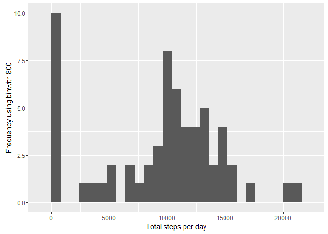

# Reproducible Research: Peer Assessment 1


## Loading and preprocessing the data


```r
require(plyr)
```

```
## Loading required package: plyr
```

```
## Warning: package 'plyr' was built under R version 3.2.3
```

```r
require(ggplot2)
```

```
## Loading required package: ggplot2
```

```
## Warning: package 'ggplot2' was built under R version 3.2.3
```

```r
unzip("activity.zip")
activity <- read.csv("activity.csv", header = TRUE)
activity <- transform(activity, date = as.Date(date))
```

## What is mean total number of steps taken per day?

Find the total number of steps taken per day.

```r
stepsPerDay <- tapply(activity$steps, activity$date, sum, na.rm=TRUE)
```

Plot a histogram of the total number of steps taken per day.

```r
qplot(stepsPerDay, xlab='Total steps per day', ylab='Frequency using binwith 800', binwidth=800)
```



Compute the `mean` and `median` total number of steps taken per day.

```r
meanStepsPerDay <- mean(stepsPerDay)
medianStepsPerDay <- median(stepsPerDay)
```

- The mean is 9354.23
- The median is 10395

## What is the average daily activity pattern?

```r
interval <- aggregate(activity[1],by=activity[3],FUN=mean,na.rm=TRUE)
plot(x=interval$interval, y=interval$steps,main="Average Steps",type="l",
     xlab="Interval", ylab="No. of Steps")
```


**Maximum Steps**


```r
max_interval <- interval[interval$steps==max(interval$steps),]

max_interval[1] # maximum interval
```

```
##     interval
## 104      835
```

```r
round(max_interval[2],1) # maximum steps per interval
```

```
##     steps
## 104 206.2
```

The maximum average steps per period occur at interval 835, with an average of 206.2 steps per 5 minutes.

## Imputing missing values


## Are there differences in activity patterns between weekdays and weekends?
